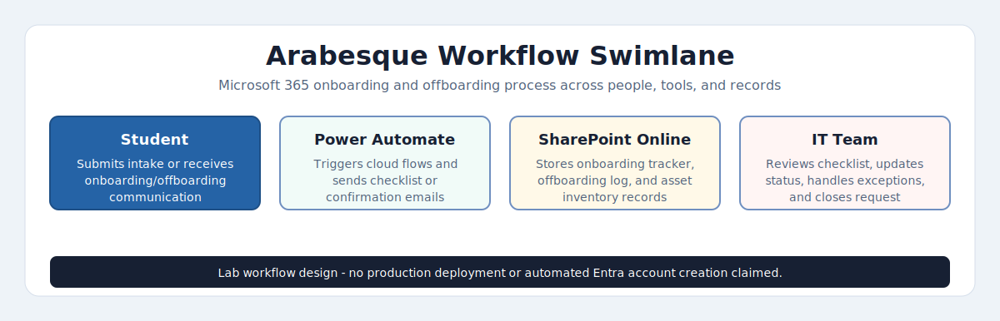

# Project Arabesque — Microsoft 365 IT Automation

### Microsoft 365 · Power Automate · SharePoint Online · Microsoft Forms · Low-Code IT Automation

**Md Rahat Islam Anik · Microsoft 365 Automation Case Study · 2026**

[](https://rahatislamanik-spec.github.io/Project-Arabesque)
[](https://linkedin.com/in/rahatislamanik)
[](https://github.com/rahatislamanik-spec)

---

| 3 SharePoint Systems Built | 2 Automated Cloud Flows | 4 Email Templates Tested | No New Vendor Platform |
|:---:|:---:|:---:|:---:|

---

## The Brief

Project Arabesque is a self-directed Microsoft 365 automation case study based on a performing-arts school scenario. International boarding students arrive every semester from around the world. Each one needs a Microsoft 365 account, a configured device, network access, and residence coordination. Without automation, that's a manual checklist for a small IT team.

The project models an end-to-end IT automation system for international student onboarding and offboarding using Microsoft 365 services that many education organizations already license.

> Scope note: this repository is a portfolio case study, not a claim of production deployment or official affiliation with any school.

---

## The Problem

**The Scale Problem**
300+ staff, students, visiting choreographers, and international partners — all supported by a small IT team. Manual onboarding doesn't scale without breaking something important.

**The Stakes Problem**
This isn't a tech company. When something breaks the morning of a performance, or a student arrives and their account isn't ready, it matters in a way that a missed meeting notification never does.

**The Tooling Problem**
The solution shouldn't require a $40,000 enterprise platform or a vendor contract when the workflow can be covered with existing Microsoft 365 services.

**The International Variable**
Students arrive from Japan, Brazil, South Korea, the UK — different time zones, language needs, arrival dates. The onboarding process needs to reduce manual coordination and keep the IT team working from one source of truth.

---

## The Solution

> Three systems. Two flows. Reduced manual coordination.

Project Arabesque is a Microsoft 365 IT Operations Hub built around SharePoint Online, Microsoft Forms, Power Automate, and Office 365 Outlook. It demonstrates how intake, tracking, email notifications, and device assignment records can work together without adding a separate ticketing or onboarding platform.

### Evidence Status

| Area | Status | Evidence |
|---|---|---|
| SharePoint lists | Configured in lab | Screenshots show onboarding tracker, offboarding log, and asset inventory structure |
| Onboarding automation | Built and tested with sample records | Screenshots show Forms intake, SharePoint tracking, and student/IT notification emails |
| Offboarding automation | Built and tested with sample records | Screenshots show flow trigger, student confirmation, and IT checklist email |
| Production deployment | Not claimed | This is a self-directed portfolio case study |
| Physical device testing | Not included | Device assignment is tracked as SharePoint data, not validated through Intune enrollment |

### Onboarding Flow



This swimlane shows how Microsoft Forms, Power Automate, SharePoint Online, notifications, and IT review work together across the onboarding and offboarding lifecycle.

[View interactive HTML version](https://rahatislamanik-spec.github.io/Project-Arabesque/docs/onboarding-offboarding-swimlane.html)

```
Microsoft Forms          Power Automate           Outputs
─────────────────        ──────────────           ──────────────────────
Student submits    →     Cloud flow          →    SharePoint Tracker
intake request           triggered                Welcome Email → Student
                         on submission            IT Alert Checklist
                                                  Asset Inventory Log
```

### Offboarding Flow

```
SharePoint Item          Power Automate           Outputs
─────────────────        ──────────────           ──────────────────────
Departure logged   →     Offboarding flow    →    IT Offboard Checklist
by IT team               triggered                Student Confirmation
                                                  Offboarding Log Updated
```

---

## What Was Built

### Phase 1 — IT Operations Portal

Three SharePoint lists form the operational backbone — an onboarding tracker, an offboarding log, and a device asset inventory. Every student, every request, every device assignment: one portal.

- **Student Onboarding Tracker** — sample data showing student name, country of origin, arrival date, account status, device assignment, and onboarding completion
- **Offboarding Log** — departure records with account disable status, license reclaim confirmation, and audit trail
- **IT Asset Inventory** — device assignment tracking across the student body

### Phase 2 — Automated Onboarding Flow

When a new student intake form is submitted via Microsoft Forms, Power Automate triggers the onboarding workflow. The flow:

- Creates and populates the student record in the SharePoint Onboarding Tracker
- Sends a personalized welcome email to the student with account and access details
- Generates an IT Alert checklist for the IT team with all required provisioning tasks
- Logs the device assignment to the Asset Inventory

### Phase 3 — Automated Offboarding Flow

When IT logs a student departure in SharePoint, the offboarding flow runs from the new offboarding item:

- Generates an IT Offboard Checklist covering account disable, license reclaim, and device return
- Sends a confirmation email to the departing student
- Updates the Offboarding Log with completion status for audit purposes

---

## Tech Stack

| Category | Tools & Services |
|---|---|
| Forms & Intake | Microsoft Forms |
| Automation | Power Automate (Cloud Flows) |
| Data & Tracking | SharePoint Online (3 Lists) |
| Notifications | Office 365 Outlook |
| Collaboration | Microsoft Teams |
| Platform | Microsoft 365 |

---

## Technical Artifacts

| Artifact | Purpose |
|---|---|
| [docs/sharepoint-schema.md](docs/sharepoint-schema.md) | Full column schemas for all 3 SharePoint lists — types, required fields, indexed columns, views |
| [docs/flow-logic.md](docs/flow-logic.md) | Step-by-step Power Automate flow documentation — triggers, actions, conditions, error handling |
| [scripts/New-M365OnboardingUser.ps1](scripts/New-M365OnboardingUser.ps1) | PowerShell script using Microsoft Graph API to create M365 account, assign license, add to groups |
| [docs/images/onboarding-offboarding-swimlane.svg](docs/images/onboarding-offboarding-swimlane.svg) | Visual swimlane showing full onboarding and offboarding lifecycle |

---

## Skills Demonstrated

`Power Automate` · `Cloud Flow Design` · `SharePoint Online` · `Microsoft Forms` · `IT Process Automation` · `Low-Code Integration` · `IT Asset Management` · `Onboarding Workflow Design` · `Microsoft 365 Administration` · `Enterprise IT Operations`

---

## Live Case Study

The full interactive case study — covering the problem, solution architecture, flow diagrams, and SharePoint configuration — is published at:

**[rahatislamanik-spec.github.io/Project-Arabesque](https://rahatislamanik-spec.github.io/Project-Arabesque)**

Supporting evidence is mapped in [docs/evidence-map.md](docs/evidence-map.md).

## Limitations

- This is a self-directed lab and documentation project, not a verified production rollout.
- Screenshots use sample student records and demonstration workflow data.
- Device lifecycle tracking is represented in SharePoint; it does not prove physical device enrollment or Intune compliance.
- The workflows demonstrate notification and tracking logic, not automated Entra ID account creation through Graph API.
- A production rollout would need approval workflow design, exception handling, audit retention, data privacy review, and break-glass operating procedures.

---

## Author

**Md Rahat Islam Anik**
Microsoft 365 · IT Automation · Support Operations Portfolio

[](https://linkedin.com/in/rahatislamanik)
[](https://github.com/rahatislamanik-spec)

---

## 🌐 Portfolio Ecosystem

This project is part of a multi-repo enterprise IT portfolio covering the full IT lifecycle.

| Layer | Project | Focus |
|---|---|---|
| 01 — Network Foundation | [Enterprise IT Network Diagnostics Toolkit](https://github.com/rahatislamanik-spec/Enterprise-IT-Network-Diagnostics-Toolkit) | DNS · Connectivity · Network Diagnostics |
| 02 — User Lifecycle | **You are here** | Onboarding · Offboarding · M365 Automation |
| 03 — Identity & Security | [Enterprise IT Security Operations Toolkit](https://github.com/rahatislamanik-spec/Enterprise-IT-Security-Operations-Toolkit) | Entra ID · Intune · Defender · Zero Trust |
| 04 — M365 Operations | [Meridian Institute M365 Lab](https://github.com/rahatislamanik-spec/Meridian-Institute-M365-Lab) | Exchange · Teams · SharePoint · Purview |

👉 [View Full Portfolio](https://rahatislamanik-spec.github.io/IT-Portfolio-Rahat-Islam-Anik/)
